# Face Crop Plus

[](https://zenodo.org/badge/latestdoi/621262834)
[](https://pypi.org/project/face-crop-plus/)
[](https://www.python.org/downloads/release/python-3100/)
[](https://developer.nvidia.com/cuda-toolkit)
[](https://opensource.org/licenses/MIT)

<p align="center" width="100%">

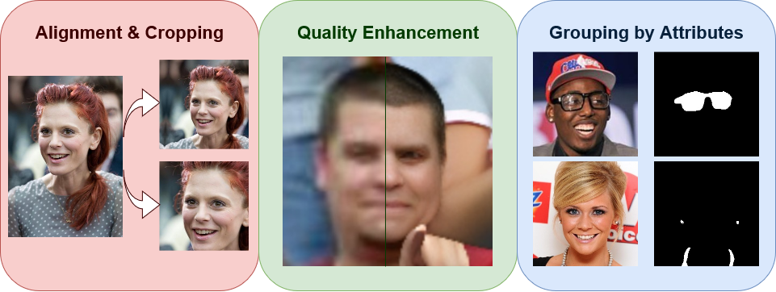

</p>

## About

Image preprocessing package for automatic face alignment and cropping with additional features. It provides the following functionality:
1. **Face cropping** - face alignment and center-cropping using facial landmarks. Landmarks can be automatically predicted or, if they are already know, can be supplied through a separate file. It is possible to specify face factor, i.e., face area relative to the cropped image, and face extraction strategy, e.g., all faces or largest face per image.
2. **Face enhancement** - face image quality enhancement. If images are blurry or contain many small faces, quality enhancement model can be used to make the images clearer. Small faces in the image are automatically checked and and enhanced if desired.
3. **Face parsing** - face attribute parsing and cropped image grouping to sub-directories. Face images can be grouped according to some facial attributes or some combination, such as _glasses_, _earrings and neckless_, _hats_. It is also possible to generate masks for facial attributes or some combination of them, for instance, _glasses_, _nose_, _nose and eyes_.

Please see _References_ section for more details about which models are used for each feature.

> **Note**: each feature can be used separately, e.g., if you just need to enhance the quality of blurry photos, or if you just need to generate attribute masks (like hats, glasses, face parts).

## Installation

The packages requires at least _Python 3.10_. You may also want to set up _PyTorch_ in advance from [here](https://pytorch.org/get-started/locally/). 

To install the package simply run:

```bash
pip install face-crop-plus
```

Or, to install it from source, run:
```bash
git clone https://github.com/mantasu/face-crop-plus
cd face-crop-plus && pip install .
```

## Quick Start

You can run the package from the command line:
```
face-crop-plus -i path/to/images
```

You can also use it in a Python script:
```python
from face_crop_plus import Cropper

cropper = Cropper(face_factor=0.7, strategy="largest")
cropper.process_dir(input_dir="path/to/images")
```

For a quick demo, you can experiment with [demo.py](demo/demo.py) file:
```bash
git clone https://github.com/mantasu/face-crop-plus
cd face-crop-plus/demo
python demo.py
```

For more examples, see _Examples_ section.

## Features

Here, some of the main arguments are described that control the behavior of each of the features. These arguments can be specified via command line or when initializing the `Cropper` class. For further details about how the `Cropper` class works, please refer to the documentation.

### Alignment and Cropping

The main feature is face alignment and cropping. The main arguments that control this feature:

* `landmarks` - if you don't want automatic landmark prediction and already have face landmark coordinates in a separate file, you can specify the path to it. See the table below for the expected file formats.

    | File format      | Description                                                                                                                                                                          |
    | :--------------- | :----------------------------------------------------------------------------------------------------------------------------------------------------------------------------------- |
    | `.json`          | Expects a dictionary with the following example entries: `'image.jpg': [x1, y1, ...]`. I.e., keys are image file names and values are flattened arrays of face landmark coordinates. |
    | `.csv`           | Expects comma-separated values of where each line is of the form `image.jpg,x1,y1,...`. Note that it also expects the first line to be a header.                                     |
    | `.txt` and other | Similar to CSV file, but each line is expected to have space-separated values of the form `image.jpg x1 y1 ...`. No header is expected.                                             |

* `output_size` - the output size of the cropped face images. Can be either a tuple of 2 values (weight, height) or a single value indicating square dimensions

    | 200 × 200                           | 300 × 300                           | 300 × 200                           | 200 × 300                           |
    | :---------------------------------: | :---------------------------------: | :---------------------------------: | :---------------------------------: |
    |  | 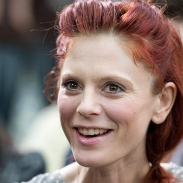 |  | 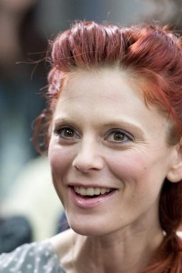 |

* `face_factor` - the fraction of the face area relative to the output image. The value is between 0 and 1 and, the larger the value, the larger the face is in the output image.

    | 0.4                           | 0.55                            | 0.7                            | 0.85                            |
    | :---------------------------: | :-----------------------------: | :----------------------------: | :-----------------------------: |
    | 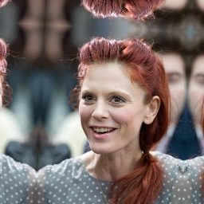 |  |  |  |

* `padding` - the type of padding (border mode) to apply after cropping the images. If faces are near edges, the empty areas after aligning those faces will be filled with some values. This could be _constant_ (leave black), _replicate_ (repeat the last value of the edge in the original image), _reflect_ (mirror the values before the edge).

    | Constant                                 | Replicate                                  | Reflect                                | Wrap                             |
    | :--------------------------------------: | :----------------------------------------: | :------------------------------------: | :------------------------------: |
    | 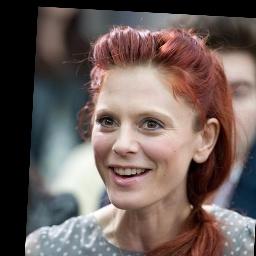 | 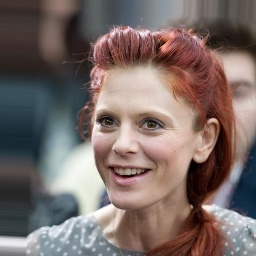 | 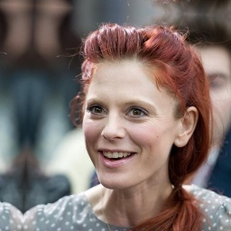 | 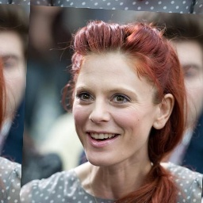 |

* `det_threshold` - if automatic detection is desired, then detection threshold, which is a value between 0 and 1, can be specified to indicate when the detected face should be considered an actual face. Lower values allow more faces to be extracted, however they can be blurry and not non-primary, e.g., the ones in the background. Higher values only alow clear faces to be considered. It only makes sense to play around with this parameter when `strategy` is specified to return more than one face, e.g., _all_. For example, if it is `0.999`, the blurry face in the background in the examples above is not detected, however if the threshold `0.998`, the face is still detected. For blurrier images, thresholds may differ.

* `strategy` - the strategy to apply for cropping out images. This can be set to _all_, if all faces should be extracted from each image (suffixes will be added to each file name), _largest_, if only the largest faces should be considered (slowest), _best_ if only the first face (which has the best confidence score) per image should be considered.

### Quality Enhancement

Quality enhancement feature allows to restore blurry faces. It has one main argument:

* `enh_threshold` - quality enhancement threshold that tells when the image quality should be enhanced. It is the minimum average face factor, i.e., face area relative to the image, below which the whole image is enhanced. Note that quality enhancement is an expensive operation, thus set this to a low value, like `0.01` to only enhance images where faces are actually small. If your images are of reasonable quality and don't contain many tiny faces, you may want to set this to _None_ (or to a negative value if using command-line) to disable the model. Here are some of the examples of the extracted faces before and after enhancing the image:

    | Face 1                 | Face 2                 | Face 3                 | Face 4                 |
    | :--------------------: | :--------------------: | :--------------------: | :--------------------: |
    | 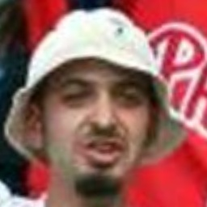 | 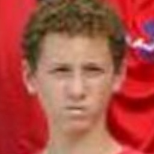 |  |  |
    |  |  |  |  |


> Quality enhancement can be used as a separate feature to enhance images that contain faces. For an end user, it is a useful feature to boost the quality of photos. It is not suggested to enhance ultra high resolution images (>2000) because your GPU will explode. See _Pure Enhancement/Parsing_ section on how to run it as a stand-alone.


### Attribute Parsing

Face parsing to attributes allows to group output images by category and generate attribute masks for that category. Categorized images are put to their corresponding sub-folders in the output directory.
* `attr_groups` - dictionary specifying attribute groups, based on which the face images should be grouped. Each key represents an attribute group name, e.g., _glasses_, _earings and neckless_, _no accessories_, and each value represents attribute indices, e.g., `[6]`, `[9, 15]`, `[-6, -9, -15, -18]`, each index mapping to some attribute. Since this model labels face image pixels, if there is enough pixels with the specified values in the list, the whole face image will be put into that attribute category. For negative values, it will be checked that the labeled face image does not contain those (absolute) values. If it is None, then there will be no grouping according to attributes. Here are some group examples with 2 sample images per group:

    | Glasses <br/> `[6]`           | Earrings and neckless <br/> `[9, 15]`       | Hats, no glasses <br/> `[18, -6]`     | No accessories <br/> `[-6, -9, -15, -18]` |
    | :---------------------------: | :-----------------------------------------: | :-----------------------------------: | :---------------------------------------: |
    |  |  |  |       |
    |  |  |  |       |

* `mask_groups` - Dictionary specifying mask groups, based on which the face images and their masks should be grouped. Each key represents a mask group name, e.g., _nose_, _eyes and eyebrows_, and each value represents attribute indices, e.g., `[10]`, `[2, 3, 4, 5]`, each index mapping to some attribute. Since this model labels face image pixels, a mask will be created with 255 (white) at pixels that match the specified attributes and zeros (black) elsewhere. Note that negative values would make no sense here and having them would cause an error. Images are saved to sub-directories named by the mask group and masks are saved to sub-directories under the same name, except with `_mask` suffix. If it is None, then there will be no grouping according to mask groups. Here are some group examples with 1 sample image and its mask per group (for consistency, same images as before):

    | Glasses <br/> `[6]`           | Earrings and neckless <br/> `[9, 15]`       | Nose <br/> `[10]`                     | Eyes and eyebrows <br/> `[2, 3, 4, 5]` |
    | :---------------------------: | :-----------------------------------------: | :-----------------------------------: | :------------------------------------: |
    |  |  |  |    |
    |  | 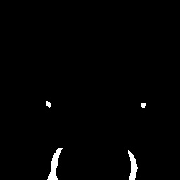 | 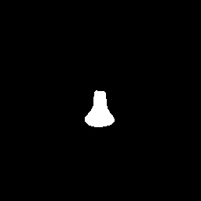 | 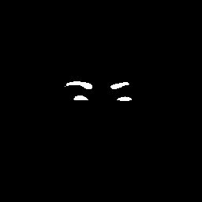   |

> If both `attr_groups` and `mask_groups` are specified, first images are grouped according to face attributes, then images in each groups are further sub-grouped to different mask groups (along with their masks).


Here are the 19 possible face attributes (with `0` representing the neutral category):

<p align="center" width="100%">

|                     |                  |                  |
| ------------------- | ---------------- | ---------------- |
| `1` - skin          | `7` - left ear   | `13` - lower lip |
| `2` - left eyebrow  | `8` - right ear  | `14` - neck      |
| `3` - right eyebrow | `9` - earrings   | `15` - neckless  |
| `4` - left eye      | `10` - nose      | `16` - clothes   |
| `5` - right eye     | `11` - mouth     | `17` - hair      |
| `6` - eyeglasses    | `12` - upper lip | `18` - hat       |

</p>

## Examples

### Running via Command Line

You can run the package via command line by providing the arguments as follows:
```bash
face-crop-plus -i path/to/images --output-size 200 300 --face-factor 0.75 -d cuda:0
```

You can specify the command-line arguments via JSON config file and provide the path to it. Further command-line arguments would overwrite the values taken from the JSON file.
```bash
face-crop-plus --config path/to/json --attr-groups '{"glasses": [6]}'
```

An example JSON config file is [demo.json](demo/demo.json). If you've cloned the repository, you can run from it:
```bash
face-crop-plus --config demo/demo.json --device cuda:0 # overwrite device
```

For all the available command line arguments, just type (although refer to documentation for more details):
```bash
face-crop-plus -h
```

> **Note**: you can use `fcp` as `face-crop-plus` alias , e.g., `fcp -c config.json`

### Pure Enhancement/Parsing

If you already have aligned and center-cropped face images, you can perform quality enhancement and face parsing without re-cropping them. Here is an example of enhancing quality of every face and parsing them to (note that none of the parameters described in _Alignment and Cropping_ section have any affect here):

```python
from face_crop_plus import Cropper

cropper = Cropper(
    det_threshold=None,
    enh_threshold=1, # enhance every image   
    attr_groups={"hats": [18], "no_hats": [-18]},
    mask_groups={"hats": [18], "ears": [7, 8, 9]},
    device="cuda:0",
)

cropper.crop(input_dir="path/to/images")
```

This would result in the following output directory structure:
```bash
└── path/to/images_faces
     ├── hats
     |    ├── hats       # Images with hats
     |    ├── hats_mask  # Hat masks for images in upper dir
     |    ├── ears       # Images with hats and visible ears
     |    └── ears_mask  # Ears masks for images in upper dir
     |
     └── no_hats
          ├── ears       # Masks with no hats and visible ears
          └── ears_mask  # Ears masks for images in upper dir
```

To just enhance the quality of images (e.g., if you have blurry photos), you can run enhancement feature separately:
```bash
face-crop-plus -i path/to/images -dt -1 -et 1 --device cuda:0
```

To just generate masks for images (e.g., as part of your research pipeline), you can run segmentation feature separately. This will only consider images for which the masks are actually present.
```bash
face-crop-plus -i path/to/images -dt -1 -et -1 -mg '{"glasses": [6]}'
```

Please beware of the following:
* While you can perform quality enhancement on images of different sizes (because, due to large amount of computations, images are processed one by one), you cannot perform face parsing (attribute-based grouping/segmentation) if images have different dimensions (though a possible work around is to set the batch size to 1).
* It is not advised to perform quality enhancement after cropping the images since there is not enough information for the model on how to improve the quality. If you still need to enhance the quality after cropping, using larger image sizes, e.g., `512×512`, may help. Regardless whether you use it before or after cropping, do not use input images of spatial size over `2000×2000`, unless you have a powerful GPU.

### Preprocessing CelebA

Here is an example pipeline of how to pre-process [CelebA](https://mmlab.ie.cuhk.edu.hk/projects/CelebA.html) dataset. It is useful if you want to customize the cropped face properties, e.g., face factor, output size. It only takes a few minutes to pre-process the whole dataset using multiple processors and the provided landmarks:
1. Download the following files from _Google Drive_:
    * Download `img_celeba.7z` folder from [here](https://drive.google.com/drive/folders/0B7EVK8r0v71peklHb0pGdDl6R28?resourcekey=0-f5cwz-nTIQC3KsBn3wFn7A) and put it under `data/img_celeba.7z`
    * Download `annotations.zip` file from [here](https://drive.google.com/file/d/1xd-d1WRnbt3yJnwh5ORGZI3g-YS-fKM9/view) and put it under `data/annotations.zip`
2. Unzip the data:
    ```bash
    7z x data/img_celeba.7z/img_celeba.7z.001 -o./data
    unzip data/annotations.zip -d data
    ```
3. Create a script file, e.g., `preprocess_celeba.py`, in the same directory:
    ```python
    from face_crop_plus import Cropper
    from multiprocessing import cpu_count

    cropper = Cropper(
        output_size=256,
        face_factor=0.7,
        landmarks="data/landmark.txt",
        enh_threshold=None,
        num_processes=cpu_count(),
    )

    cropper.process_dir("data/img_celeba")
    ```
4. Run the script to pre-process the data:
    ```bash
    python preprocess_celeba.py
    ```
5. Clean up the data dir (remove the original images and the annotations):
    ```
    rm -r data/img_celeba.7z data/img_celeba
    rm data/annotations.zip data/*.txt
    ```

## Tips

1. When using `num_processes`, only set it to a larger value if you have enough GPU memory, or reduce `batch_size`. Unless you only perform face cropping with already known landmarks and don;t perform quality enhancement nor face parsing, in which case set it to the number of CPU cores you have.
2. If you experience any of the following:
    * RuntimeError: CUDA error: an illegal memory access was encountered.
    * torch.cuda.OutOfMemoryError: CUDA out of memory.
    * cuDNN error: CUDNN_STATUS_MAPPING_ERROR.

   This is likely because you are processing images on too many processes or have a large batch size. It you run all 3 models on GPU, it may be helpful to just run on a single process with a larger batch size.

## References

This package uses the code and the pre-trained models from the following repositories:
* [PyTorch RetinaFace](https://github.com/biubug6/Pytorch_Retinaface) - 5-point landmark prediction
* [BSRGAN](https://github.com/cszn/BSRGAN) - super resolution and quality enhancement
* [Face Parsing PyTorch](https://github.com/zllrunning/face-parsing.PyTorch) - grouping by face attributes and segmentation

## Citation

If you find this package helpful in your research, you can cite the following:
```bibtex
@misc{face-crop-plus,
  author = {Mantas Birškus},
  title = {Face Crop Plus},
  year = {2023},
  publisher = {GitHub},
  journal = {GitHub repository},
  howpublished = {\url{https://github.com/mantasu/face-crop-plus}},
}
```